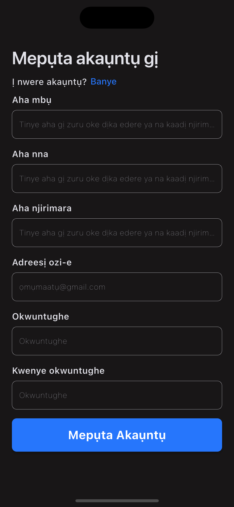
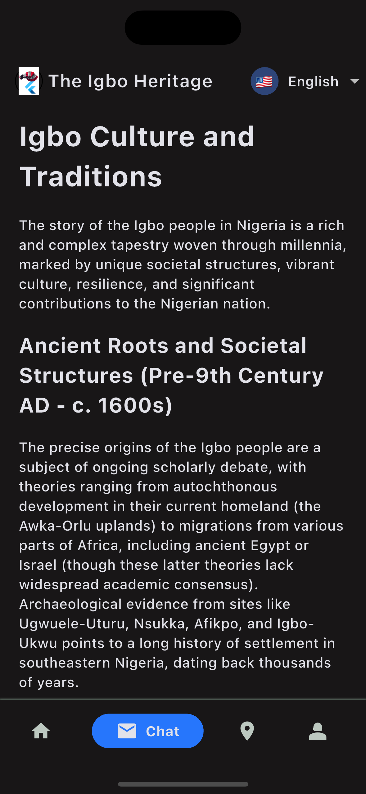
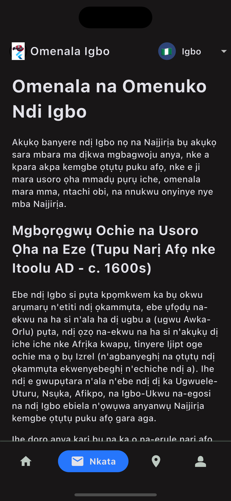
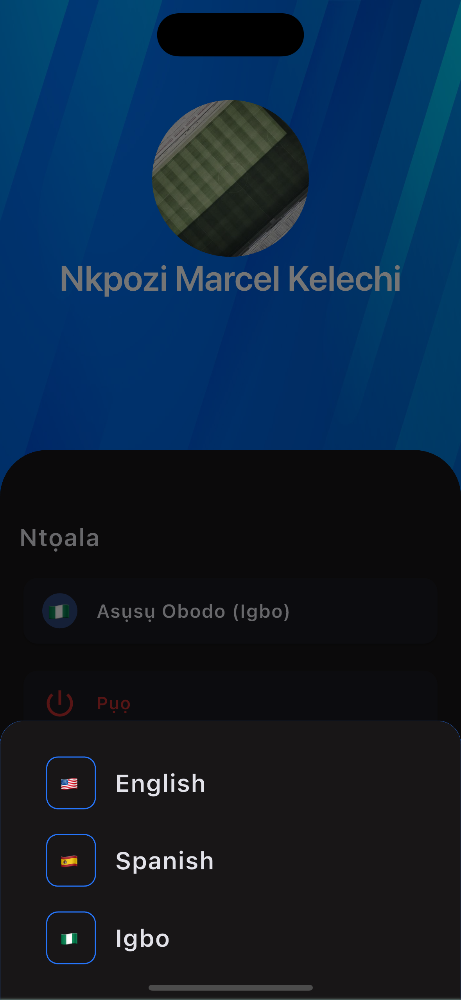
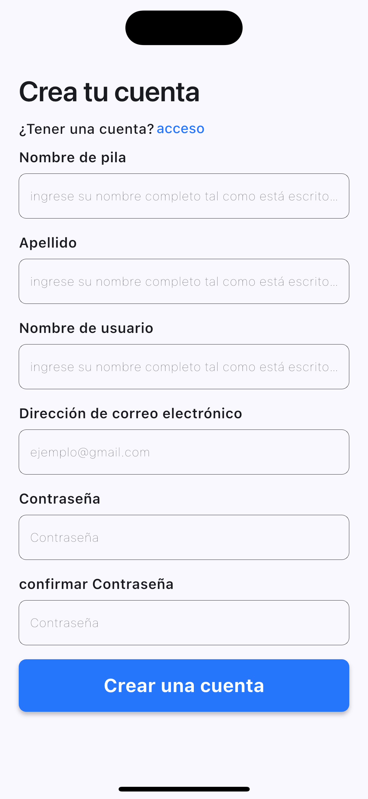
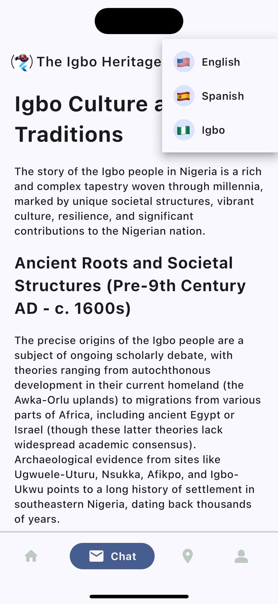
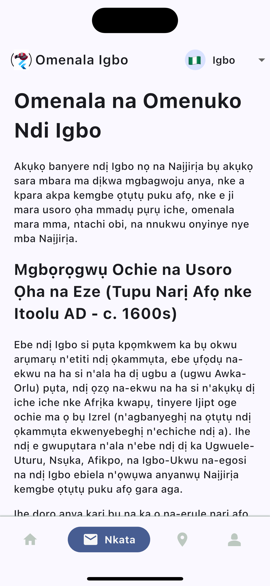
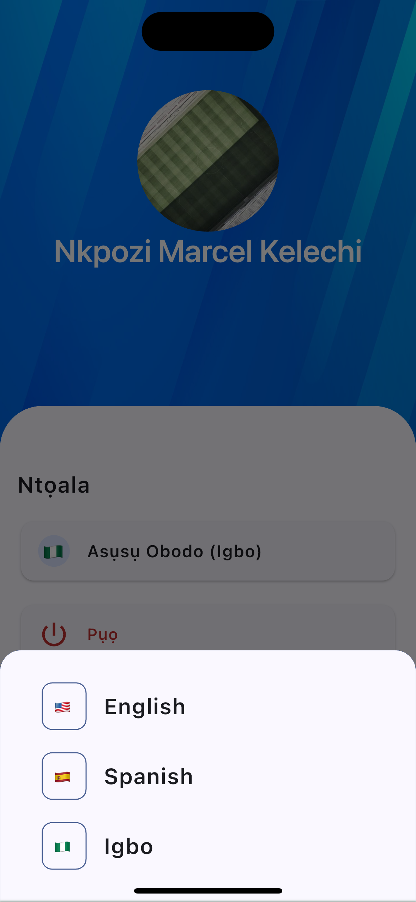

# Flutter meets Igbo: Integrating Igbo & native languages into your flutter app using Easy_localizations

<div align="center">
   
   </div>

<p>
  Welcome to <strong>Flutter Meets Igbo</strong>, a Flutter localization demo project that showcases how to add support for native languages — specifically <strong>Igbo (ig_NG)</strong> — using the powerful 
  <a href="https://pub.dev/packages/easy_localization" target="_blank">easy_localization</a> package.</br></br>
  <div>

Read the setup article: "Flutter meets Igbo: Integrate Igbo and Other Native Languages into Flutter Apps: A Step-by-Step Guide Using easy_localization": 
Medium: https://medium.com/@nkpozimarcelkelechi/flutter-meets-igbo-5c3e148f81e5
Hashnode: https://capturedheart.hashnode.dev/flutter-meets-igbo

</div>
</p>

<p>
  This project goes beyond basic text translation. It demonstrates how to:
</p>

<ul>
  <li>Integrate the <strong>Igbo language</strong> into your Flutter app.</li>
  <li>Extend <code>CupertinoLocalization</code>, <code>DefaultMaterialLocalizations</code>, and <code>WidgetsLocalizations</code> for full system-wide localization.</li>
  <li>Provide a seamless user experience for both Material and Cupertino widgets in Igbo.</li>
</ul>

<p>
  Whether you're building for a local audience or promoting cultural inclusion in your app, this project is a great starting point for embracing indigenous languages in mobile development.
</p>

<br/>

<sub>Built by <a href="https://twitter.com/_Captured_Heart">Nkpozi Marcel Kelechi (X: @Captured-Heart)</a></sub>
<br />

## AN INTRO VIDEO OF THE APP


https://github.com/user-attachments/assets/e632ac94-bfdc-4e0a-8f7c-e02f3415ddae


# Demo (What to test)

<div align="left">
- On the Chat view, you can change the locale of the app, by tapping the button at the top-right. <br/>
- On the Profile view, you can change the locale of the app, by tapping on the "Locale" button as well 🥳<br/>
- On the Home/Profile view, you can access the authentication views by tapping "Sign out", and also see that the flutter widgets (Textfield) takes in the native language.<br/>

</div>

</div>

---

## Getting Started

After cloning,

### FVM setup

it runs on flutter version: <br> flutter: ">=3.29.0" <br> dart: ">=3.7.0 <4.0.0"

Install `fvm` if not already installed.

```bash
dart pub global activate fvm
```

Install the local `flutter` version.

```bash
fvm install
```

---

# Key Features

1. Localization:

   - View the contents of the app in 3 different languages (Igbo, English, Spanish).

2. Dynamic Theme Switching

   - Users can switch between themes via their device settings.

## UI Shots

<div style="text-align: center">
  <table>
    <tr>
      <td style="text-align: center">
        
      </td>
      <td style="text-align: center">
        
      </td>
       <td style="text-align: center">
        
      </td> <td style="text-align: center">
        
      </td>
    </tr>
     <tr>
      <td style="text-align: center">
        
      </td>
      <td style="text-align: center">
        
      </td>
       <td style="text-align: center">
        
      </td> <td style="text-align: center">
        
      </td>
    </tr>
  </table>
</div>

## Tools

- [cached_network_image](https://pub.dev/packages/cached_network_image): A flutter library to show images from the internet and keep them in the cache directory
- [Easy_localizations](https://pub.dev/packages/easy_localization): Easy and fast internationalization for your flutter apps
- [Faker](https://pub.dev/packages/faker): A library for Dart that generates fake data.
- [flutter_widget_from_html](https://pub.dev/packages/flutter_widget_from_html): Flutter package to render html as widgets that supports hyperlink, image, audio, video, iframe and 70+ other tags.


